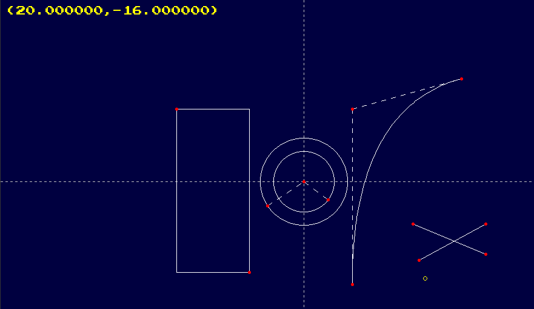

# Graphics Development Learning in C++

Learning graphics development using c++. Based on OneLoneCoder's tutorials available at [OneLoneCoder - javidx9](https://www.youtube.com/channel/UC-yuWVUplUJZvieEligKBkA)

 

 
