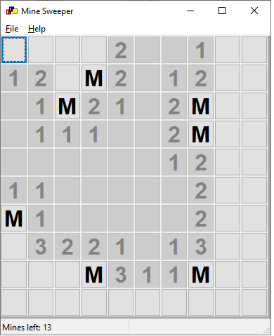
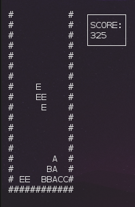

# Game Devolopment Learning in C++

Basic gaming development using c++ and ncurses library. Based on OneLoneCoder's tutorials available at [OneLoneCoder - javidx9](https://www.youtube.com/channel/UC-yuWVUplUJZvieEligKBkA)

 
