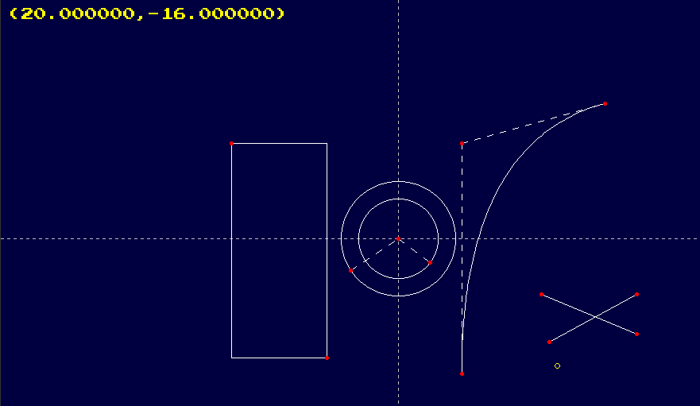

# CAD (computer aided design) program

A study of how to implement a simple CAD program. Based on [this tutorial](https://www.youtube.com/watch?v=kxKKHKSMGIg) by javidx9.

## Current state


## Compilation

```
g++ -o cad cad.cpp -lX11 -lGL -lpthread -lpng -lstdc++fs -std=c++17
```
On ubuntu based linux we need to install libpng++-dev

## Next steps:
- [x] panning and zooming
- [x] basic shapes
- [ ] save data to disk
- [ ] port the project to OpenGL